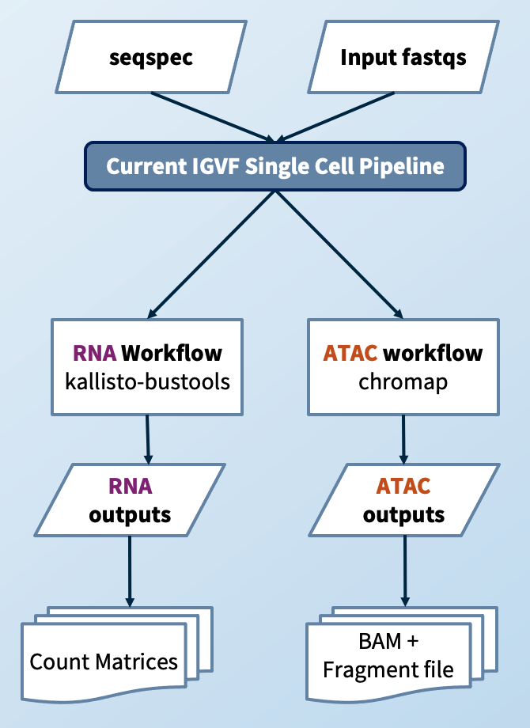

# IGVF Single-cell pipeline

Welcome to the IGVF Single Cell Pipeline repository. 

## Table of Contents

- [Introduction](#introduction)
- [Documentation](#documentation)
- [Usage](#usage)
- [Usage](#usage)
- [Contributing](#contributing)
- [License](#license)

## Introduction

This pipeline had been designed by the IGVF single-cell focus group for automated pre-processing and quality control of single-cell sequencing data. It supports native execution on the Terra/AnViL platform but can also be executed on both compute clusters with job submission engines as well as standalone machines, with built-in parallelization and distributed computing capabilities. 

The pipeline can be run with raw FASTQ files and a seqspec file describing them as inputs. The pipeline can handle ATAC and RNA modalities. Taking a seqspec in input makes the pipeline virtually suitable to process every library independently from the assay, protocol, library preparation or sequencing strategy used.
The RNA and ATAC are processed and QC independently. If the dataset is multi-modal, a final step of joint QC is performed. The main outputs of the pipeline are a fragment file for the ATAC and a count matrix for RNA along side QC metrics and a HTML report.

## Documentation

For more detailed documentation, please refer to our [Google Doc](https://docs.google.com/document/d/1NgNYDduZsThKTyND8DI1DIMwiG9q-Rt462377_NZXis/edit).

## Usage

To run the pipeline on Terra/Anvil go to the [dockstore page](https://dockstore.org/workflows/github.com/IGVF/single-cell-pipeline/IGVF-single_cell_pipeline:main?tab=info) and select export to Terra/Anvil

To run the pipeline locally you can refere to these [instructions](docs/install-pipeline-locally.org).

## Input Files

The following input files are required to run the pipeline:

- **read1_atac** *(Type: Array[File])*: First read file for ATAC sequencing data. Accepted input formats are: `local path`, `https` url, Google Storage (`gs`) url, or a `Synapse ID`. If you are only processing RNA use `[]`
- **read2_atac** *(Type: Array[File])*: Second read file for ATAC sequencing data. Accepted inputs formata are: `local path`, `https` url, Google Storage (`gs`) url, or a `Synapse ID`. If you are only processing RNA use `[]` 
- **fastq_barcode** *(Type: Array[File])*: Barcode file for ATAC sequencing data. Accepted input formats are: `local path`, `https` url, Google Storage (`gs`) url, or a `Synapse ID`. If you are only processing RNA use `[]`

- **read1_rna** *(Type: Array[File])*: First read file for RNA sequencing data. Accepted input formats are: `local path`, `https` url, Google Storage (`gs`) url, or a `Synapse ID`. If you are only processing ATAC use `[]`
- **read2_rna** *(Type: Array[File])*: Second read file for RNA sequencing data. Accepted input formats are: `local path`, `https` url, Google Storage (`gs`) url, or a `Synapse ID`. If you are only processing ATAC use `[]`
- **whitelist_atac** *(Type: Array[File])*: Whitelist file for ATAC barcodes. Accepted input formats are: `local path`, `https` url, or a Google Storage (`gs`) url. If you are only processing RNA use `[]`
- **whitelist_rna** *(Type: Array[File])*: Whitelist file for RNA barcodes. Accepted input formats are: `local path`, `https` url, or a Google Storage (`gs`) url. If you are only processing ATAC use `[]`
- **seqspecs** *(Type: Array[File])*: Seqspec file describing the sequencing data. Accepted input formats are: `local path`, `https` url, or a Google Storage (`gs`) url.
- **Chemistry** *(Type: String)*: Chemistry used in the sequencing process.
- **Prefix** *(Type: String)*: Prefix for output files.
- **Genome_tsv** *(Type: File)*: TSV formatted file containing the links to chromap and  kb inputs and other reference annotations. For human and mouse you can use the following.

| Genome | URL |
|--------|-----|
| hg38   | `gs://broad-buenrostro-pipeline-genome-annotations/IGVF_human_v43/IGVF_human_v43_Homo_sapiens_genome_files_hg38_v43.tsv` |
| mm39   | `gs://broad-buenrostro-pipeline-genome-annotations/IGVF_mouse_v32/IGVF_mouse_v32_Mus_musculus_genome_files_mm39_v32.tsv` |
| mm39_cast(beta)   | `gs://broad-buenrostro-pipeline-genome-annotations/CAST_EiJ_v1/Mus_musculus_casteij_genome_files.tsv` |

## Output Files

### RNA
| Name | Suffix | Description |
|--------|-----|--------|
| `rna_mtx_tar `| .mtx.tar.gz | [Raw] Tarball containing four separated count matrices in mtx format: Spliced, Unspliced, Ambiguous, and Total |
| `rna_mtxs_h5ad` | .rna.align.kb.{genome}.count_matrix.h5ad | [Raw] h5ad containing four separated count matrices: Spliced, Unspliced, Ambiguous, and Total |
| `rna_aggregated_counts_h5ad` | .cells_x_genes.total.h5ad | [Raw] Aggregated(Ambiguous+Spliced+Unspliced) count matrix in h5ad format |
| `rna_barcode_metadata` | .qc.rna.{genome}.barcode.metadata.tsv | [Raw] Per barcode alignment statistics file |
| `rna_log` | .rna.log.{genome}.txt | [Raw] Log file from kb |
| `rna_kb_output` | .rna.align.kb.{genome}.tar.gz | [Raw] Tarball containing all the logs and bus files generated from kb |

### ATAC

| Name | Suffix | Description |
|--------|-----|--------|
| `atac_bam` | .atac.align.k4.{genome_name}.bam | [Raw] Aligned bam file from Chromap |
| `atac_bam_log` | .atac.align.k4.{genome}.log.txt | [Raw] Log file from aligner |
| `atac_fragments` | .tsv.gz | [Raw] Fragment file from Chromap |
| `atac_fragments_index`  | .tsv.gz.tbi | [Raw] Fragment file index from Chromap |
| `atac_chromap_barcode_metadata` | .chromap.barcode.metadata.tsv | [Raw] Per barcode alignment statistics file from Chromap |
| `atac_snapatac2_barcode_metadata` | .snapatac2.barcode.metadata.tsv | [Filtered] Per barcode statistics file from SnapATAC2 |

### Joint

| Name | Suffix | Description |
|--------|-----|--------|
| `joint_barcode_metadata` | .joint.barcode.metadata.{genome}.csv | [Filtered] Joint per barcode statistics file |
| `csv_summary` | .csv | [Filtered] CSV summary report |
| `html_summary` | .html | [Filtered] HTML summary report |

## Contributing

We welcome contributions to improve this pipeline. Please fork the repository and submit a pull request with your changes. For major changes, please open an issue first to discuss what you would like to change.

## License

This project is licensed under the MIT License. See the [LICENSE](LICENSE) file for details.
